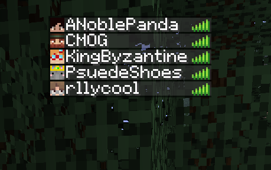
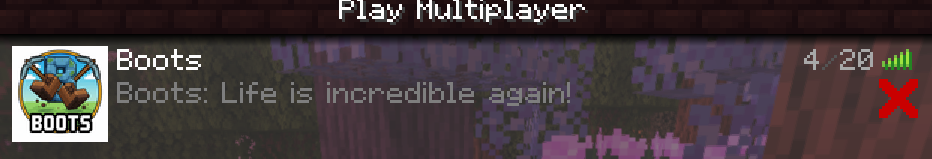

## Docker Minecraft Server ##

A self-hosted ${\color{red}Modded}$ Minecraft server for me and my friends to play on!

This container uses a [CurseForge](https://www.curseforge.com) API to download modpacks listed in your `docker-compose.yaml` file.

## Mods ##
[Raspberry-flavoured](https://www.curseforge.com/minecraft/modpacks/raspberry-flavoured)
 

 ## Commands ##
 
 _Build Command_: `docker compose up -d`
 
 _Status_: `docker compose ps`
 
_Check Logs_: `docker compose logs -f`

_Stop Container_: `docker compose stop`

## Reference
[docker-minecraft-server](https://github.com/itzg/docker-minecraft-server?tab=readme-ov-file)
